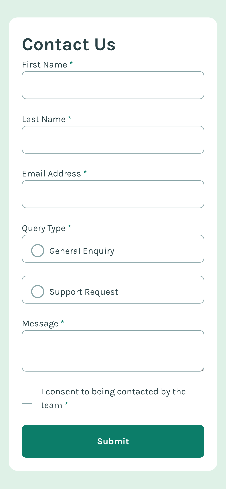
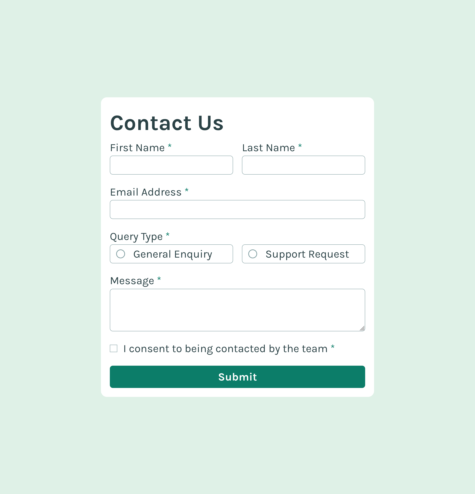

# Frontend Mentor - Contact form solution

This is a solution to the [Contact form challenge on Frontend Mentor](https://www.frontendmentor.io/challenges/contact-form--G-hYlqKJj). Frontend Mentor challenges help you improve your coding skills by building realistic projects.

## Table of contents

- [Frontend Mentor - Contact form solution](#frontend-mentor---contact-form-solution)
  - [Table of contents](#table-of-contents)
  - [Overview](#overview)
    - [The challenge](#the-challenge)
    - [Screenshot](#screenshot)
    - [Links](#links)
  - [My process](#my-process)
    - [Built with](#built-with)
    - [What I learned](#what-i-learned)
    - [Continued development](#continued-development)
    - [Useful resources](#useful-resources)
  - [Author](#author)

## Overview

### The challenge

Users should be able to:

- Complete the form and see a success toast message upon successful submission
- Receive form validation messages if:
  - A required field has been missed
  - The email address is not formatted correctly
- Complete the form only using their keyboard
- Have inputs, error messages, and the success message announced on their screen reader
- View the optimal layout for the interface depending on their device's screen size
- See hover and focus states for all interactive elements on the page

### Screenshot




### Links

- Solution URL: [Add solution URL here](https://your-solution-url.com)
- Live Site URL: [Add live site URL here](https://your-live-site-url.com)

## My process

### Built with

- Semantic HTML5 markup
- CSS custom module
- Flexbox
- CSS Grid
- Mobile-first workflow
- [React](https://reactjs.org/) - JS library

### What I learned

```js
export function invalidInput(input) {
  return input.length === 0 || input.trim() === "";
}

export function invalidEmail(email) {
  const emailPattern = /([a-zA-Z0-9._-]+@[a-zA-Z0-9._-]+\.[a-zA-Z0-9._-]+)/g;
  const isValidEmail = emailPattern.test(email);
  return !isValidEmail;
}

export function invalidCheckBox(check) {
  return check === false;
}

export function invalidRadioSelect(radio) {
  if (radio !== "support-request" && radio !== "general-enquiry") {
    return true;
  }
}
```

### Continued development

- Reacts Hooks
- React UI Component Libraries
- Building Reusable Components

### Useful resources

- [Please stop using px for font-size](https://www.youtube.com/watch?v=xCSw6bPXZks&ab_channel=CoderCoder) - This video from coder coder youtube channel about using rem for font-size helped me understand how px is a fix unit when it comes to font-size.
- [<input>: The HTML Input element](https://developer.mozilla.org/en-US/docs/Web/HTML/Element/inputm) - This is an amazing article which helped me to understand the different kinds of input type field attributes.

## Author

- Frontend Mentor - [@mayor-creator](https://www.frontendmentor.io/profile/mayor-creator)
- Bluesky - [@mayor-creator.bsky.social](https://bsky.app/profile/mayor-creator.bsky.social)
- Threads - [@mayor_creator](https://www.threads.net/@mayor_creator)
